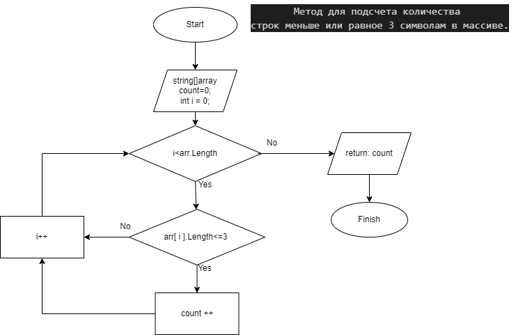
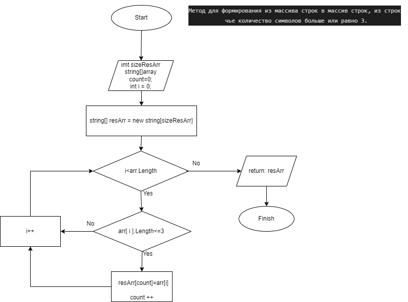

# ИТОГОВАЯ ПРОВЕРОЧНАЯ РАБОТА
## 1. Создал репозиторий на Git_Hub

## 2. Создал блок схему метода для подсчета количества строк меньше или равное 3 символам в массиве.

`CountingCharArray`
На вход принимает массив из строк а на выходе получает количество строк  где число символов меньше или равно трем.

## 3. Создал блок схему метода для формирования из массива строк в массив строк, из строк чье количество символов меньше или равно трем.
`CreatArrayShortString`  
На вход принимает массив из строк и число для размера массива а на выходе получает массив  из строк чье количество символов меньше или равно трем.

## 4. Написал метод `CreatStringArray` для создания и заполнения массива.
На вход принимает число введеное пользователем для размера массива, далее строки вводит пользователь.
На выходе получаем массив из строк.

## 5. Написал метод `PrintStringArray` для печати массива.
На вход принимает массив из строк.

## 6. Написал метод `CountingCharArray` для подсчета количества строк меньше или равное 3 символам в массиве.
На вход принимает массив из строк а на выходе получает количество строк  где число символов меньше или равно трем.

## 7. Написал метод `CreatArrayShortString`  для формирования из массива строк в массив строк, из строк чье количество символов меньше или равно трем.
На вход принимает массив из строк и число для размера массива а на выходе получает массив  из строк чье количество символов меньше или равно трем.

## 8. Проверил правильность выполнения программы.